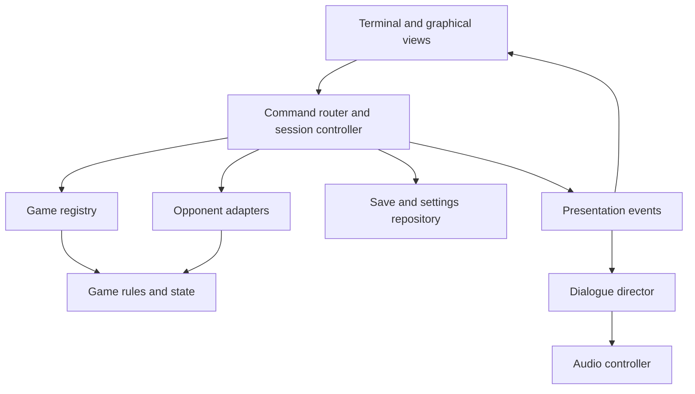

# Architecture: Would you like to play a game

> Proposed design, not an implemented Python application. This document covers the new desktop arcade, not the existing Java, iOS, or Android games. See [README.md](README.md) for the product overview and existing project instructions.

## Goals and scope

Build an offline Python desktop arcade inspired by the retro-computing atmosphere of WarGames. Default to a simulated command line, with an original modem handshake and mechanical speech. Allow players to switch to enhanced retro or modern graphical presentation without losing a match.

The initial catalog comprises tic tac toe, English/American checkers, chess, and **Galatic Thermal Nuclear War**. Retain that requested spelling. The planetary game is an explicitly imaginary arcade board game with invented planets and abstract resources; exclude real-world geography, factions, weapons specifications, and operational military modeling.

Use original dialogue, sounds, and art. The original host, **ORBIT**, delivers concise event-driven observations. An online language model is unnecessary.

This documentation change introduces no application code, dependencies, assets, or packaging. Existing platform applications and their build instructions remain separate.

## User experience

Startup proceeds through a skippable connection sequence, welcome, and game catalog. Provide Mute and Skip before playback starts. The theatrical connection needs no network access.

| Presentation | Layout | Input |
| --- | --- | --- |
| Terminal (default) | Green/amber text, ASCII board, transcript, prompt | Commands and keyboard |
| Enhanced retro | Pixel board and terminal transcript | Keyboard and mouse |
| Modern | Graphical board, clear controls, accessible contrast | Clickable moves and command palette |

Themes are views over the same session. Voice and effects preferences are independent. Persist theme, font size, text speed, reduced motion, voice selection, and separate volume settings.

Decorative typing must not delay access to complete text for assistive technology. All essential information remains visible with sound disabled. Provide original short lines such as “I have calculated several possibilities. You may still surprise me.”

Parse a fixed application command language. Never pass entered text to a shell, evaluate it as Python, or use it to construct executable commands.

## Technology decisions

| Area | Proposed choice | Integration boundary |
| --- | --- | --- |
| Desktop UI | PySide6 / Qt Widgets | Presentation adapters |
| Audio playback | Qt Multimedia | Audio controller |
| Mechanical speech | eSpeak NG | Managed subprocess speech adapter |
| Optional system speech | pyttsx3 | Alternative speech adapter |
| Chess rules | python-chess | Chess rules adapter |
| Chess opponent | Stockfish executable, UCI | Opponent adapter |
| Checkers rules | pydraughts, English/American variant | Checkers rules adapter |
| Checkers opponent | Bounded alpha-beta search | Worker process |
| Storage | Standard-library sqlite3 and JSON | Repository |
| Domain models | Standard-library dataclasses and enums | Core |
| Tests | Standard-library unittest initially | Rules and service boundaries |

Verify compatible releases, platform support, APIs, and packaging at implementation time; this design intentionally does not pin speculative versions.

PySide6 supports both visual styles inside one desktop application. Avoid mixing multiple GUI event loops. Textual is a possible later frontend for an actual terminal, sharing the domain and application layers.

pydraughts supplies rules and engine communication, not a guaranteed ready-made opponent for this application. Start with bounded search over legal actions, and evaluate an external engine only after checking variant and license compatibility.

### Primary references

- [Qt Widgets](https://doc.qt.io/qtforpython-6/PySide6/QtWidgets/index.html)
- [Qt Multimedia](https://doc.qt.io/qtforpython-6/overviews/qtmultimedia-multimediaoverview.html)
- [eSpeak NG](https://github.com/espeak-ng/espeak-ng)
- [pyttsx3](https://github.com/nateshmbhat/pyttsx3)
- [python-chess documentation](https://python-chess.readthedocs.io/en/stable/)
- [Stockfish](https://github.com/official-stockfish/Stockfish)
- [pydraughts](https://github.com/AttackingOrDefending/pydraughts)
- [Textual](https://textual.textualize.io/)

The repository currently uses MIT. That does not relicense dependencies. python-chess and Stockfish use GPL licenses; pydraughts identifies MIT licensing and includes additional notices. Evaluate the complete dependency and distribution arrangement before shipping, including Qt and speech backends. Update THIRD_PARTY_NOTICES.md when actual dependencies or assets are added. This design does not change LICENSE or assume a final distribution model.

## Architecture

Use a modular monolith: one application with explicit internal boundaries and no required backend.

| Component | Owns | Must not own |
| --- | --- | --- |
| Application shell | Startup, catalog, navigation, settings | Game rules |
| Session controller | Turn lifecycle, validation, scheduling, cancellation | Board-specific rendering |
| Game module | Initial state, legal actions, transitions, outcomes | UI, speech, storage |
| Opponent adapter | Action selection and difficulty/time budget | Authoritative state mutation |
| Presentation adapter | Text/board view models | Rules enforcement |
| Dialogue director | Original lines selected from events | Move decisions |
| Audio controller | Synthesis, queue, caching, playback, mute | Match progress |
| Repository | Versioned saves and preferences | Executable object loading |

### Patterns

- **Strategy:** exchange opponents and difficulty policies.
- **Adapter:** isolate third-party rules, engines, and speech.
- **State machine:** make session transitions explicit.
- **Observer/events:** distribute accepted changes to views, history, and dialogue.
- **Repository:** keep storage separate from domain logic.
- **Registry:** explicitly register games without growing central game-specific conditionals.

Do not add a dependency-injection framework or network service without a concrete need. Constructor-provided adapters are sufficient initially.

### Proposed package organization

The following paths are a future layout, not files created by this design:

| Future path | Purpose |
| --- | --- |
| python/would_you_like_to_play/ | Isolated Python application root |
| .../application/ | Session controller, commands, registry |
| .../domain/ | Shared contracts, actions, outcomes, events |
| .../games/ | Separate tic tac toe, chess, checkers, planetary modules |
| .../opponents/ | Search and external-engine adapters |
| .../presentation/ | Qt shell and theme-specific views |
| .../audio/ | Speech adapters, mixer/controller, cache |
| .../persistence/ | Save and preference repository |
| .../assets/ | Original dialogue, sounds, fonts/art with provenance |
| python/tests/ | Domain, adapter, persistence, and lifecycle checks |

Preserve existing java/, ios/, android/, shared/, and tests/ content. A future Python project can have its own dependency metadata and packaging within python/.

## Game contracts and state

Each registered game declares:

- Stable game ID, display name, rules version, and state schema version.
- Initial state from settings and an optional seed.
- Legal actions for a player and validation without mutation.
- Application of an action or resolution of a simultaneous round.
- Outcome: ongoing, win/loss, draw, shared victory, or shared loss where supported.
- Validated serialization and deserialization.
- Presentation data independent of Qt.
- Capabilities such as hints, undo, analysis, or simultaneous turns.

Prefer immutable snapshots or controlled copies at boundaries. An accepted action is the only path to a state transition. Reject invalid actions without partial mutation.

Alternating games use player-turn and computer-turn states. The planetary game uses commit, reveal, and resolve states; do not force it through alternating moves. UI themes consume the same snapshot.

### Lifecycle

Application: connecting → catalog → active session → catalog/exit.

Alternating session: player turn → computer thinking → player turn, with pause and finished transitions.

Simultaneous session: collect commitments → reveal both → resolve once → next round or finished.

Each asynchronous job carries a session ID and state revision. Apply its result only if both still match and the action remains valid.

Hints are optional capabilities and should disclose whether they affect challenge scoring. Define undo behavior per game; do not silently rewind only half a player/computer turn.

## Opponents

| Game | Initial strategy | Difficulty |
| --- | --- | --- |
| Tic tac toe | Random beginner; minimax expert | Randomness / optimal play |
| Checkers | Alpha-beta over library legal moves | Search budget and evaluation |
| Chess | Stockfish through UCI | Supported strength controls and bounded time |
| Planetary | Public-state policies | Cautious, Competitive, Reciprocal, Erratic |

Heavy Python search runs in a worker process. External engines run as managed subprocesses. Keep Qt updates on the UI thread. Enforce deadlines, cancel on session changes, and shut down owned workers on exit. A late answer must never enter a new game.

Use fixed executable paths/configuration and argument arrays for external engines, not shell interpolation. Missing engines produce an actionable message; other catalog games remain available.

## Audio design

Use separate logical channels for effects, narration, and optional ambience. Voice is initially enabled at moderate volume, with mute available before startup audio.

The speech adapter produces an audio asset or reports unavailability. Evaluate eSpeak NG for a deliberately mechanical voice, optionally with restrained filtering. pyttsx3 may provide a platform-dependent alternative. Prototype voice quality, cancellation, and packaging on each target OS.

Cache generated speech by text, backend/version, voice, speed, and effect parameters. Bound the cache and queue. Announce selections, moves, and outcomes instead of reading ASCII characters. Prioritize important outcomes over disposable chatter.

Mute immediately stops playback and clears queued speech. Skip intro cancels its audio and timers. Leaving a game cancels its narration and search. Failures or missing audio devices result in fully playable silent operation. Do not play obsolete narration when audio is re-enabled.

## Persistence

Use a local SQLite repository with validated JSON match payloads. Store preferences separately from match state. Saves include:

- Game ID, rules version, state schema version, and save format version.
- Current state, turn/round phase, move history, and difficulty settings.
- Random seed and generator state needed for reproducible continuation.
- Relevant opponent policy state, such as prior public rounds.
- Creation/update timestamps.

Initially save simultaneous games at completed round boundaries to avoid exposing hidden commitments. State that limitation in the UI. Never use pickle or executable object deserialization for saves.

Use atomic transactions. Validate identifiers, payload shape, bounds, and supported versions before loading. Preserve an incompatible save and explain the issue instead of silently resetting it. Define migrations only when versions actually change.

## Galatic Thermal Nuclear War: provisional design

Subtitle: **An imaginary planet-versus-planet arcade game.**

Use geometric invented worlds such as Vela-9 and Orison, exaggerated moons, fictional technology, and abstract points. The mechanics should make cooperative survival a discoverable outcome.

### Starting balance targets

- Each planet: 10 energy, 5 shield, 10 stability.
- Round income: 3 energy, capped at 15.
- Actions: Charge, Shield, Pulse, Repair, Offer Accord.
- Pulse consumes energy, removes shield before stability, and raises shared rift instability.
- Mutual accord lowers instability and advances a shared peace objective.
- Three consecutive mutual accords produce a shared victory.
- Zero stability produces defeat; simultaneous zero produces mutual collapse.
- Maximum rift instability produces shared loss.
- A round cap ends remaining unresolved matches as draws.

These are provisional targets. Before coding, define action costs/effects, shield/stability caps, instability threshold, round limit, initial income timing, failed-action handling, and precedence when several endings coincide.

### Simultaneous resolution requirements

1. Grant income at the documented round boundary.
2. Give each policy the same permitted public snapshot and its own private state.
3. Validate and commit actions against that snapshot.
4. Reveal only after both commitments exist.
5. Compute effects from both actions and apply a documented resolution table.
6. Evaluate terminal conditions once, using explicit precedence.
7. Record the resolved round and emit presentation events.

No policy may inspect the player's current hidden action. Resolution must not depend on whether the player or computer is processed first. Test symmetry under swapping the planets.

An optional Explore Outcomes mode runs seeded computer-versus-computer matches and reports survival, shared wins, and collapse. Report observed results without claiming a strategy is proven optimal. Balance work should check for endless defense and dominant single-action strategies.

## Verification and delivery

### First playable slice

Connection → catalog → tic tac toe → computer response → result → save/resume → theme switch. Establish cancellation and silent operation here. Add complete audio, chess, checkers, then the planetary game.

### Acceptance criteria

- Illegal moves never mutate state.
- Expert tic tac toe cannot lose across reachable legal play.
- Checkers enforces the selected variant, mandatory captures, multi-jumps, promotion, and documented draws.
- Chess handles promotion, castling, en passant, checkmate, draw claims, and automatic draws.
- Theme changes preserve the exact session state.
- Mute interrupts playback and clears pending narration.
- Restart/exit cancels work; stale results cannot mutate sessions.
- Saves round-trip and reproduce continuation where randomness applies.
- Simultaneous resolution is symmetric and keeps hidden actions private.
- Missing engines, speech backends, or audio devices fail gracefully.
- Keyboard-only use, scaling, focus, and reduced motion work in both main themes.

Use focused domain and lifecycle tests, mocked external failures, and manual desktop/audio checks. Package and smoke-test the current OS first; report other platforms as unverified until tested. Do not claim existing repository CI validates the planned Python application.

## Implementation prompts

Use the shared brief with each prompt, then execute the numbered increments in order. These prompts authorize future implementation when explicitly submitted; this document itself is design-only.

### Shared brief

> Build an offline Python desktop application named “Would you like to play a game” in an isolated python/ area of Retro-Games. Preserve existing applications and documents. Follow architecture.md. Use PySide6 Qt Widgets and Qt Multimedia, a default simulated terminal, a skippable original modem sequence, original mechanical speech, persistent independent audio controls, and a modern theme switchable during a match. The original host ORBIT uses concise event-driven dialogue. Separate game rules, sessions, opponents, presentation, audio, and persistence. Use validated local versioned saves. Keep search and speech generation off the UI thread, cancel on session changes, and reject stale results. Never execute user commands as shell input. Required games are tic tac toe, English/American checkers, chess, and the explicitly fictional planet-versus-planet Galatic Thermal Nuclear War. Verify dependency APIs, versions, licenses, and platform support before integration. Deliver working increments with focused tests and accurate run instructions.

### 1. Foundation and tic tac toe

> Implement the shared brief through a complete tic tac toe experience. Create package boundaries, game contracts, registry, session state machine, command router, Qt shell, skippable connection presentation, catalog, terminal and modern boards, random beginner and unbeatable minimax opponents, preferences, and save/resume. Keep speech behind a replaceable interface. Verify illegal moves, unbeatable play, save round trips, mid-game theme switching, and stale-response rejection. Provide actual run instructions and clearly identify unfinished features.

### 2. Retro speech and modem audio

> Add original modem effects and offline mechanical narration. Evaluate eSpeak NG on the target platform and implement a speech adapter; make pyttsx3 an optional alternative. Use Qt Multimedia playback, bounded caching/queues, separate effects/voice volume, immediate mute, skip, and cancellation. Keep input responsive and silent operation playable. Verify session changes clear narration and re-enabling audio does not play obsolete lines. Document runtime dependencies, platform checks, and asset provenance.

### 3. Chess

> Add chess through python-chess and a managed Stockfish UCI subprocess. Implement typed and graphical moves, promotion selection, legal-move feedback, difficulty, hints, history, outcomes, and save/resume. Bound thinking time and reject stale results. Handle missing/failed engines with an actionable message. Verify special moves, checkmate, draw claims, automatic draws, cancellation, and shutdown. Document acquisition and distribution requirements without changing the repository license implicitly.

### 4. Checkers

> Add English/American checkers using pydraughts after verifying its rules and API. Implement both views, forced captures, full multi-jump selection, promotion, outcomes, saves, and a bounded alpha-beta opponent with adjustable difficulty. Separate search from the rules adapter. Document draw rules and verify that international draughts rules are not selected accidentally. Test capture chains, promotion, no-legal-move outcomes, and cancellation.

### 5. Fictional planetary game

> Implement Galatic Thermal Nuclear War as an original abstract science-fiction arcade game. First complete the provisional rules in architecture.md with explicit costs, caps, timing, resolution table, ending precedence, and round limit. Implement simultaneous commit/reveal/resolve turns with validation against the round snapshot and processing-order-independent results. Opponents may use public state and previous rounds but cannot inspect current hidden player actions. Add Cautious, Competitive, Reciprocal, and Erratic policies, seeded randomness, both visual themes, original narration, round-boundary saves, and optional outcome exploration. Test resource bounds, ending precedence, hidden-action isolation, symmetry, reproducibility, and representative balance scenarios.

### 6. Release readiness and extension

> Finish the application against the acceptance criteria. Verify keyboard use, scaling, reduced motion, immediate mute, startup skipping, save handling, missing engines, audio recovery, and process shutdown. Package and smoke-test the current OS and state which platforms remain unverified. Add appropriate dependency/asset notices. Demonstrate extension boundaries by adding Signal Breaker with computer code-setting and code-solving roles, without game-specific branches in the shell. Keep catalog expansions beyond this scope as future work.
